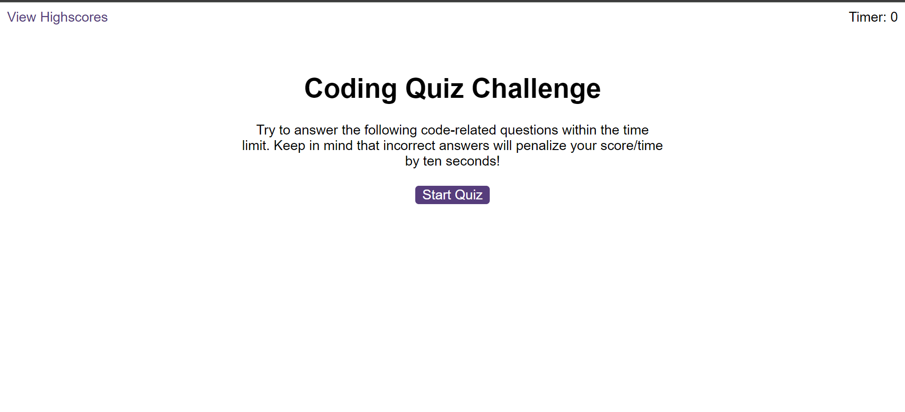
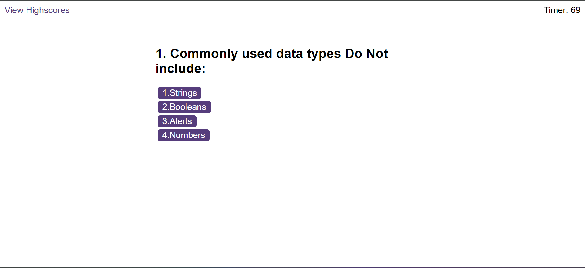
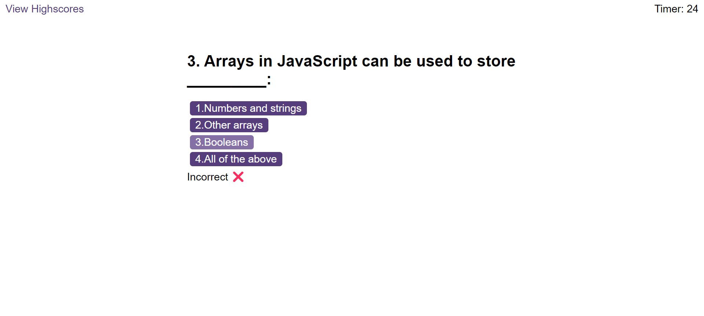
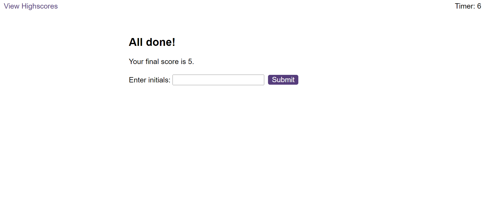

# javascriptfundamentalsquiz

This week we have to build a timed coding quiz with multiple-choice questions. This app will run in the browser, and will feature dynamically updated HTML and CSS powered by JavaScript code that you write. It will have a clean, polished, and responsive user interface. 

# User story
A coding boot camp student wants to take a timed quiz on JavaScript fundamentals that stores high scores
so that he/she can gauge their progress compared to their peers.

# Acceptance Criteria

A code quiz that contains the following requirements:

* A start button that when clicked a timer starts and the first question appears.
 
  * Questions contain buttons for each answer.
  * When answer is clicked, the next question appears
  * If the answer clicked was incorrect then subtract time from the clock
  * The quiz should end when all questions are answered or the timer reaches 0.
  * When the game ends, it should display their score and give the user the ability to save their initials and their score.

  # Screenshots

